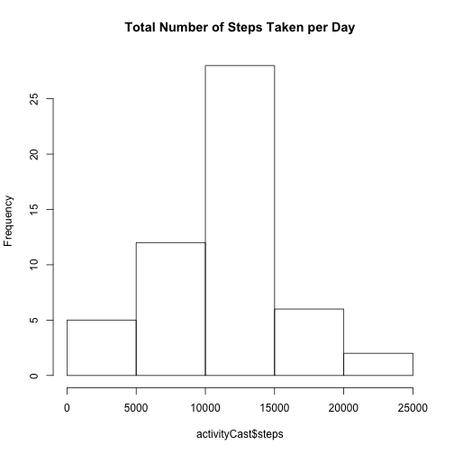

# Reproducible Research: Peer Assessment 1
This assignment uses data on the number of steps taken in 5 minute intervals over two months tht was colleted from a personal activity monitoring device. The data is in the actvity csv available in the repository for this assignment.

## Loading and preprocessing the data
The data is assumed to be downloaded to the working directory. It is read into the workspace and rows with NA measurements are removed.

```r
activity <- read.csv("activity.csv")
activity2 <- na.omit(activity)
```

## What is mean total number of steps taken per day?
To calculate the mean number of steps taken per day, first the rows with NA values will be removed. Then the data set is melted into long form data, then recast taking the sum or the steps taken for each day. The reshape2 package is used in this step and it is assumed that the package has been installed. A histogram of the number of steps taken each day is show. 


```r
library(reshape2)
activityMelt <- melt(activity2, id.vars = c("date"))
activityCast <- dcast(activityMelt, date ~ variable, sum)
hist(activityCast$steps, main="Total Number of Steps Taken per Day")
```

 
The column mean of the steps in this recast data is then taken to determine the mean number of steps taken per day.

```r
options(scipen=999)
options(digits=0)
meanSteps <- mean(activityCast$steps)
medianSteps <- median(activityCast$steps)
```
The mean number of steps per day is 10766 and the median steps per day is 10765.

## What is the average daily activity pattern?
To visualize the average daily activity patter, the average of number steps for all days at each interval is taken. These values are plotted to see the average pattern of steps taken through out a day.


```r
aggActivity <- aggregate(steps~interval, data=activity2, FUN=mean)
plot(aggActivity, type = "l", main="Average Daily Activity Pattern")
```

 
The interval number with the maximum average number of steps can be determined by ordering the data frame by decreasing number of steps and looking at the first row.

```r
maxInterval <- aggActivity[order(aggActivity$steps, decreasing=TRUE), ]
Row <- maxInterval[1,1]
```
The interval with the highest average number of steps is 835.

## Sorry, ran out of time to finish the last sections!
